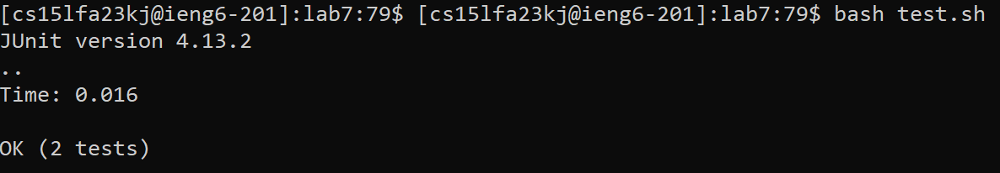

# CSE 15L - Lab Report 3
Natalie Ti (A17510793)
Section: Tuesday, 10-11:50am B270

## Steps
1. Log into ieng6
Keys pressed: ``ssh cs15lfa23kj@ieng6.ucsd.edu``

2. Clone fork of repository
Keys pressed: ``git clone git@github.com:nataliehti/lab7.git``

3. Run the tests to show that they fail
Keys pressed:  
``cd lab
bash test.sh``

5. Edit the code
Keys pressed:  
``
vim ListExamples.java  
: 44 <enter> e r 2 <esc> : wq
``

7. Run the tests again to show that they pass 
Keys pressed: ``bash test.sh``

6. Commit and push changes 
Keys pressed:  
``
git add .  
git commit -m "index1 changed to index2"  
git push
``

