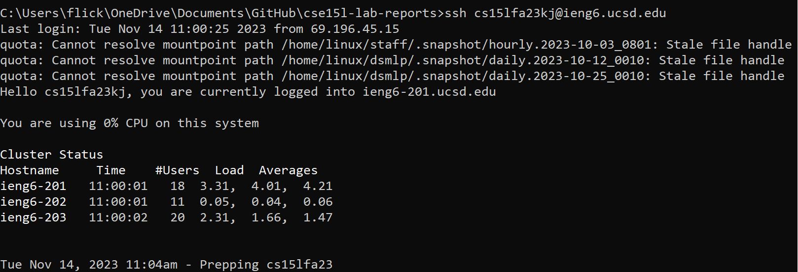
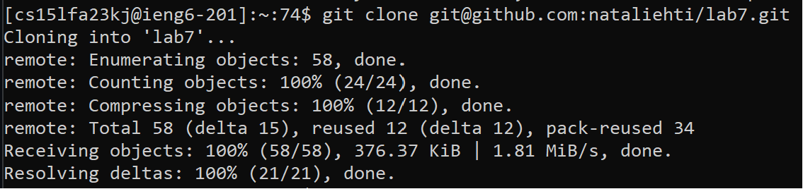
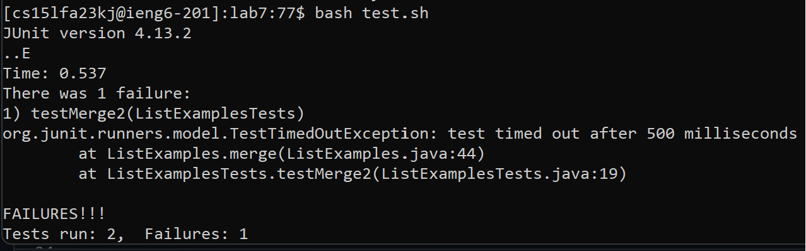
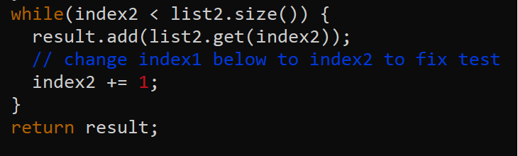

# CSE 15L - Lab Report 3  
Natalie Ti (A17510793)  
Section: Tuesday, 10-11:50am B270

## Steps
1. Log into ieng6  
Keys pressed: ``ssh cs15lfa23kj@ieng6.ucsd.edu``  

2. Clone fork of repository  
Keys pressed: ``git clone git@github.com:nataliehti/lab7.git``  

3. Run the tests to show that they fail  
Keys pressed:  
``cd lab7`` - changes directory to lab7   
``bash test.sh`` - compiles and runs ListExamples, ListExamplesTests  

5. Edit the code  
Keys pressed:  
``vim ListExamples.java`` - open ListExamples in vim
``: 44 <enter> e r 2 <esc> : wq`` - : switches to command line mode, 44 <enter> moves to line 44, e moves to end of word, r 2 replaces character with 2, wq saves and quits vim  

7. Run the tests again to show that they pass  
Keys pressed: ``bash test.sh``- runs tests  

8. Commit and push changes  
Keys pressed:  
``git add .`` - adds changes  
``git commit -m "index1 changed to index2"`` - creates commit  
``git push`` - pushes changes  

