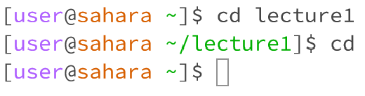
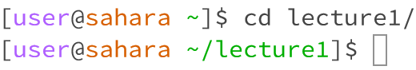
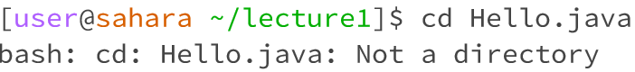
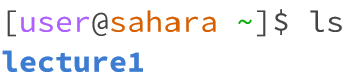
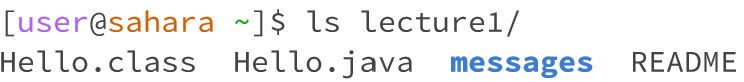
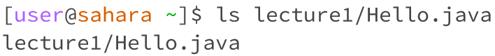
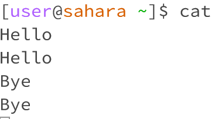
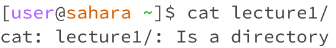
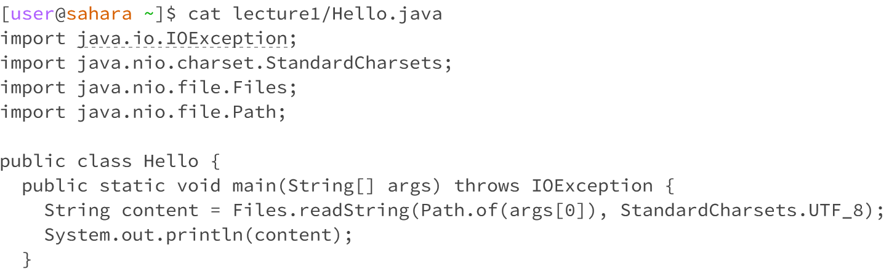

# CSE 15L - Lab Report 1
Natalie Ti (A17510793)
Section: Tuesday, 10-11:50am B270

## Using the command `cd`

1. Without arguments, `cd` outputs nothing. `cd` is used to change directories, so without any arguments, nothing happens.

2. With a directory argument, `cd` adds the directory to the command prompt, meaning future commands should be given within the directory.

3. With a file argument, an error is returned because the file is not a directory. `cd` is for directories and will not work on files.

## Using the command `ls`

1. Without arguments, `ls` outputs all the file names in the workspace -- `ls` stands for "list arguments."

2. With a directory, `ls` outputs all the file names in the directory.

3. With a file, `ls` re-outputs the file path. Because Hello.java is just a file, `ls` relists the argument. 

## Using the command `cat`

1. Without arguments, `cat` changes the input method. Whatever text the user puts into terminal, is returned back.

2. With a directory, `cat` returns an error for an invalid input. `cat` stands for "concatenate," and cannot return the contents of a folder containing files.

3. With a file, `cat` first imports libraries needed to convert the code in the file to a String, then outputs its contents as text.

