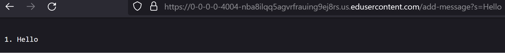
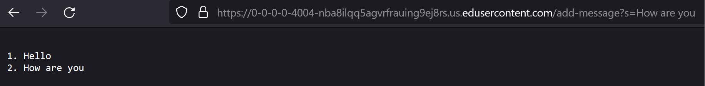
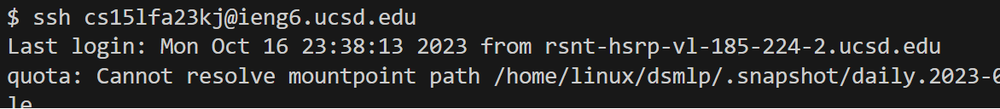

# CSE 15L - Lab Report 2
Natalie Ti (A17510793)
Section: Tuesday, 10-11:50am B270

## Part 1

1. The methods `handleRequest` and `formatArray` were used.
2. `handleRequest` takes the argument `URI url`, referring to the URL that links to the page being hosted on the server. Depending on if the URL has a specific query, the method will add the given parameter to an ArrayList in the format "1. msg". The URL used for this example is *https://0-0-0-0-4004-nba8ilqq5agvrfrauing9ej8rs.us.edusercontent.com/add-message?s=Hello*. `formatArray` takes `ArrayList<String> messages` and is called to take the elements from the ArrayList and create a new string to arrange them in a list format. In this specific instance, `messages` will have only one element `"1.
   Hello"`.
3. The query `parameters[1]` varies depending on the link. In this case, `parameters[1] = "Hello"` and is reflected in the returned text.

1. The methods `handleRequest` and `formatArray` were also used.
2. Both methods function the same way but `handleRequest` takes the link *https://0-0-0-0-4004-nba8ilqq5agvrfrauing9ej8rs.us.edusercontent.com/add-message?s=How%20are%20you* and `messages` will contain two elements: "1. Hello" and "2. How are you".
3. This time, `parameters[1] = "How+are+you"` but is reformatted with `.replace()` to replace the "+"s with " "s.

 
## Part 2 

1.   
     
2.    
  
3.   

  
## Part 3
I did not know how to start a local server or that you could change pages in real time with the url. While doing the code for StringServer, I also learned how to use the function String.format() which I had previously never used. I also learned new commands: mkdir, scp, and ssh. 
