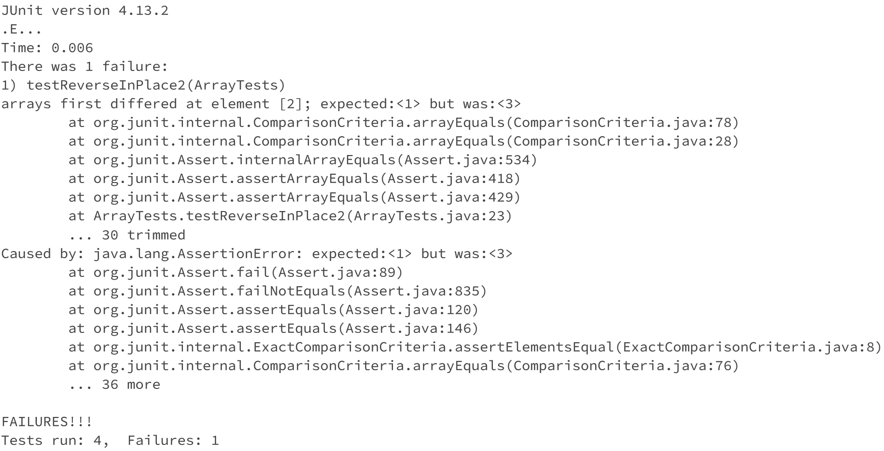

# CSE 15L - Lab Report 3
Natalie Ti (A17510793)
Section: Tuesday, 10-11:50am B270


## Part 1 - Bugs 

Failure inducing input for ArrayExamples reverseInPlace()
```
@Test 
	public void testReverseInPlace2() {
    int[] input = {1,2,3};
    ArrayExamples.reverseInPlace(input);
    assertArrayEquals(new int[]{3,2,1}, input);
	}
```

Passing input
```
@Test
  public void testReverseInPlace3(){
    int[] input = {1};
    ArrayExamples.reverseInPlace(input);
    assertArrayEquals(new int[]{1}, input);
  }
```

Symptom - doesn't swap the first part of the array to the second part 


reverseInPlace before fix
```
static void reverseInPlace(int[] arr) {
    for(int i = 0; i < arr.length; i += 1) {
      arr[i] = arr[arr.length - i - 1];
    }
  }
```

reverseInPlace after fix 
```
static void reverseInPlace(int[] arr) {
    for(int i = 0; i < arr.length/2; i += 1) {
      int temp = arr[i];
      arr[i] = arr[arr.length - i - 1];
      arr[arr.length-i-1] = temp
    }
  }
```

Initially, reverseInPlace did not swap the elements, it only wrote over it without storing the initial values. For the fix, a temp variable is used to store the initial values, and serve as a placeholder to swap the values from front to back. The loop length is halved because it only needs to go halfway to swap.

## Part 2 - Researching Command `grep` 
`grep` looks for specified patterns in files 
1. `grep -i` searches the contents in the file for the pattern but its not case sensitive -- it treats upper and lower case characters as the same.
   Example 1: Shows general function, outputs instances from the file where the pattern was found.
   ```
   $ grep -i "base pair" technical/biomed/gb-2001-2-7-research0025.txt
        the 3.2 billion base pair (bp) human genome is
          obtain a median of 0.017 entries per base pair for known
          genes and 0.005 entries per base pair for anonymous
   ```
   Example 2: "basE pair" condition shows case insensitivity to upper/lower case, output is identical to example 1.
   ```
   $ grep -i "basE pair" technical/biomed/gb-2001-2-7-research0025.txt
        the 3.2 billion base pair (bp) human genome is
          obtain a median of 0.017 entries per base pair for known
          genes and 0.005 entries per base pair for anonymous
   ```
2. `grep -r` is used to search recursively through a directory. Pairing it with other command-line options is useful for finding all files that match the specified conditions.
   Example 1: `grep -r` by itself listed all files in technical/government/Alcohol_Problems whose contents contain "culture".
   ```
   $ grep -r "culture" technical/government/Alcohol_Problems
    technical/government/Alcohol_Problems/DraftRecom-PDF.txt:biggest barrier was how to change the culture in the ED so that
    technical/government/Alcohol_Problems/Session4-PDF.txt:radically change the culture of the organization. The majority of
    technical/government/Alcohol_Problems/Session4-PDF.txt:will foster the development of a culture of acceptance of role
    technical/government/Alcohol_Problems/Session4-PDF.txt:broad a change in service culture for this approach to be readily
   ```
   Example 2: `grep -r` can be paired with other command-line options. `-o` only lists the instances, hence just "culture" at the end of each line. `-n` also lists the line numbers, hence the numbers at the end specifying which line the instance came from. This demonstrates the usefulness of `-r` as all of these conditional searches can be applied to multiple files at once. 
   ```
   $ grep -r -o -n "culture" technical/government/Alcohol_Problems
    technical/government/Alcohol_Problems/DraftRecom-PDF.txt:372:culture
    technical/government/Alcohol_Problems/Session4-PDF.txt:163:culture
    technical/government/Alcohol_Problems/Session4-PDF.txt:244:culture
    technical/government/Alcohol_Problems/Session4-PDF.txt:336:culture
   ```
3. `grep -n` is the same as `grep -i` but case sensitive and incldues the line numbers.
   Example 1: `grep -n` also includes the line number to identify where the instance from. 
   ```
   $ grep -n "HIV" technical/plos/pmed.0020023.txt
    6:        The HIV epidemic is continuing to grow, year by year. According to the Joint United
    7:        Nations Programme on HIV/AIDS (UNAIDS), in 2004 there were more people living with the
    9:        although in the developed world HIV/AIDS is a controllable disease, one with which a       
    15:        have been poured into combating HIV/AIDS—around US$4.7 billion in 2003—UNAIDS estimates   
    18:        middle-income countries. One of the real dilemmas, therefore, of HIV/AIDS policy is       
    26:        have a catastrophic effect on the global toll of HIV/AIDS by 2020. In this theoretical    
    29:        that there will be 3.7 million new HIV infections and 2.6 million adults dying of AIDS in 
   ```
   Example 2: Unlike `grep -i`, `grep -n` is case sensitive. "hiv" does not yield the same results as "HIV". 
   ```
   $ grep -n "hiv" technical/plos/pmed.0020023.txt
   ```
4. `grep -o` outputs just the instances where the pattern occurs without the other contents on the line.
   Example 1: Instead of outputing the entire line where the instance occurs, it only outputs the actual instance "answer". 
   ```
   $ grep -o "answer" technical/biomed/1468-6708-3-3.txt
    answer
    answer
   ```
   Example 2: Again, demonstrates that it only outputs the instance, not the entire line. 
   ```
   $ grep -o "infant" technical/biomed/1471-244X-3-5.txt
    infant
    infant
    infant
    infant
    infant
    infant
    infant
    infant
    infant
    infant
    infant
    infant
    infant
   ```

