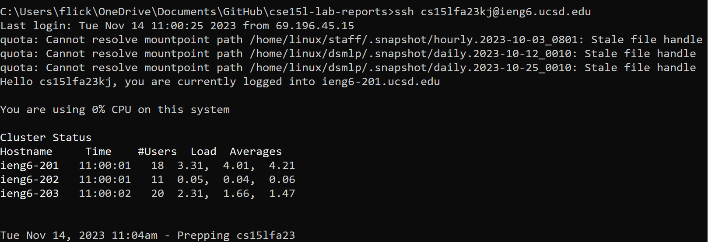
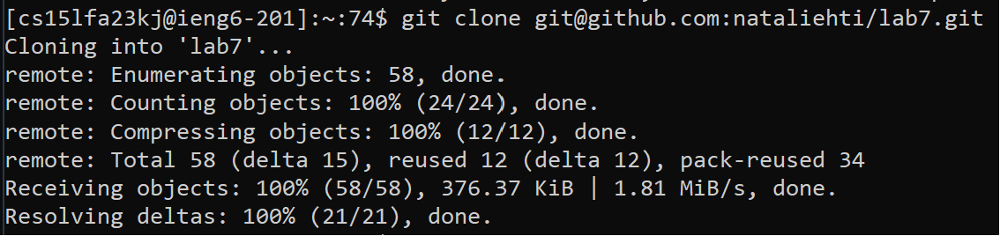
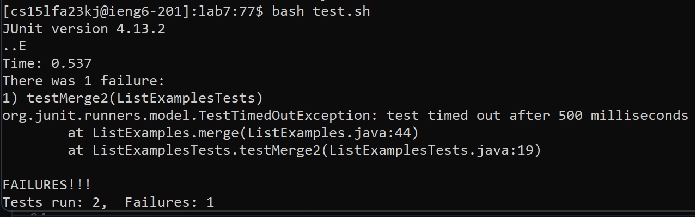
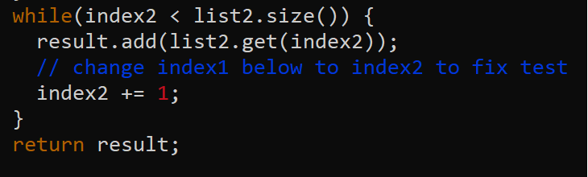
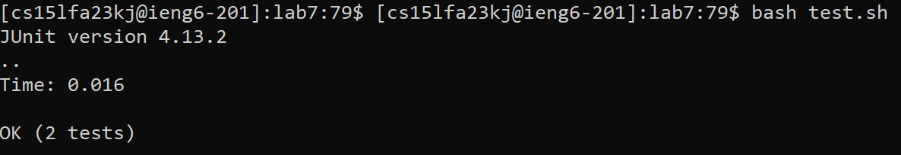
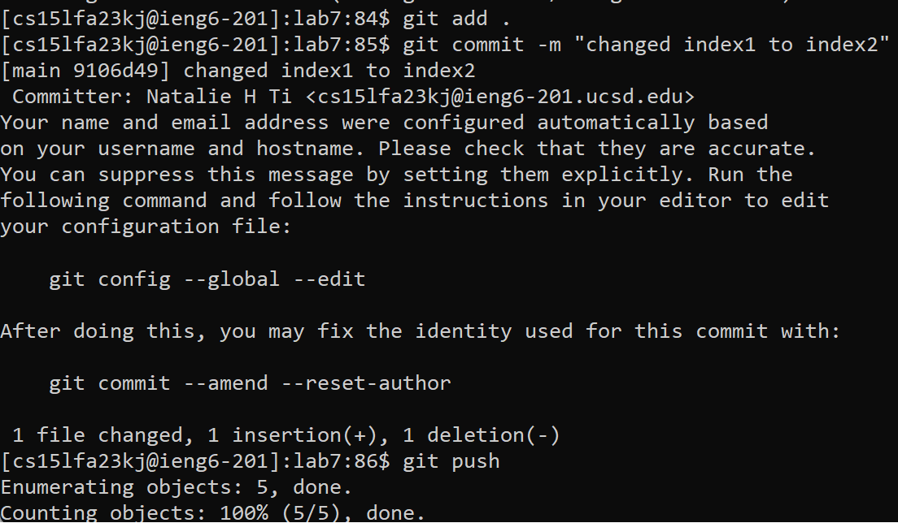

# CSE 15L - Lab Report 4  
Natalie Ti (A17510793)  
Section: Tuesday, 10-11:50am B270

## Steps
1. Log into ieng6  
Keys pressed:
``ssh cs15lfa23kj@ieng6.ucsd.edu`` logs into ieng6 account  

3. Clone fork of repository  
Keys pressed:
``git clone git@github.com:nataliehti/lab7.git`` clones my fork of lab7  

5. Run the tests to show that they fail  
Keys pressed:  
``cd lab7`` changes directory to lab7   
``bash test.sh`` compiles and runs ListExamples and ListExamplesTests, output shows that Junit tests fail  

6. Edit the code  
Keys pressed:  
``vim ListExamples.java`` opens ListExamples in vim to edit the file  
``:`` switches to command line mode  
``44 <enter>`` moves the cursor to line 44  
``e`` moves to the last character of the current word (the first word in the line)  
``r 2`` replaces the current character with "2"  
``<esc>`` leaves edit mode  
``: wq`` enters command lien mode, saves the file, and quits vim    

8. Run the tests again to show that they pass  
Keys pressed: ``bash test.sh`` runs tests, output shows that they pass   

9. Commit and push changes  
Keys pressed:  
``git add .`` adds changes  
``git commit -m "index1 changed to index2"`` creates commit  
``git push`` pushes changes  

