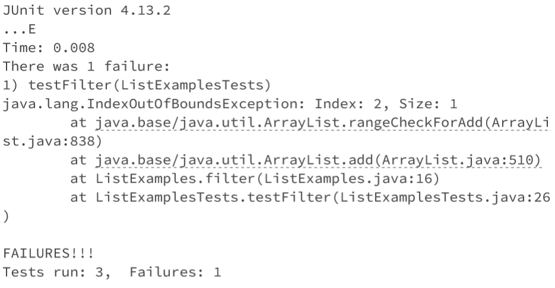
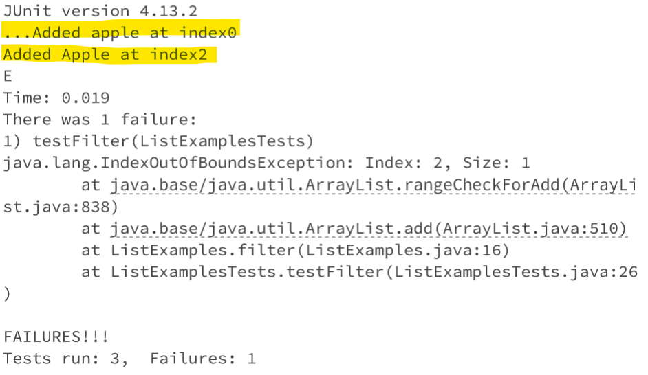
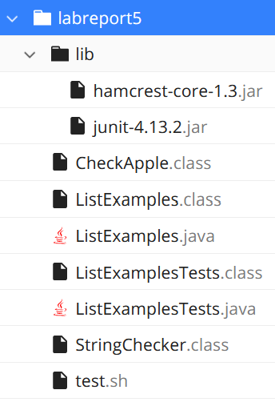
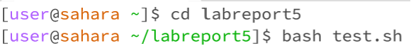

# CSE 15L - Lab Report 5  
Natalie Ti (A17510793)  
Section: Tuesday, 10-11:50am B270


## Part 1
### Student post:  
  
I'm having issues with the filter method of ListExamples. I am getting an index out of bound error which I think could indicate that my result list size is wrong. I think my conditional is correctly checking if the list item is the indicated string so I'm not sure how to go about solving this issue.  

### TA reply:  
To double check that your code is correctly filtering the input list, try adding a print line at every iteration to see what is being added to your result list. Maybe also try printing the index number to see if the order of the elements is wrong too. This might clue as to what the error could be: either you are not filtering the input list correctly or there is a problem with adding them to the result list.

### Student reply:  
  
I tried it and realized that I was adding the elements to the list wrong. I noticed this when I saw the index numbers skipped in the print lines. I was adding them at the index of the initial list, but that would be wrong because the list sizes can be different after filtering out the wrong strings. Thank you!  

### Setup information:  

Repository for the code: https://github.com/nataliehti/labreport5  
File and directory structure:  
  

Files:

test.sh -- for running the files  
```
javac -cp .:lib/hamcrest-core-1.3.jar:lib/junit-4.13.2.jar *.java
java -cp .:lib/hamcrest-core-1.3.jar:lib/junit-4.13.2.jar org.junit.runner.JUnitCore ListExamplesTests
```
  
ListExamplesTests.java -- contains the Junit tests  
```
import static org.junit.Assert.*;
import org.junit.*;
import java.util.Arrays;
import java.util.List;

class CheckApple implements StringChecker {
  public boolean checkString(String s) {
    return s.equalsIgnoreCase("apple");
  }
}

public class ListExamplesTests {
  @Test(timeout = 500)
  public void testMergeRightEnd() {
    List<String> left = Arrays.asList("a", "b", "c");
    List<String> right = Arrays.asList("a", "d");
    List<String> merged = ListExamples.merge(left, right);
    List<String> expected = Arrays.asList("a", "a", "b", "c", "d");
    assertEquals(expected, merged);
  }

  @Test(timeout = 500)
  public void testFilter() {
    List<String> input1 = Arrays.asList("apple", "banana", "Apple");
    CheckApple sc = new CheckApple();
    List<String> output1 = ListExamples.filter(input1, sc);
    assertEquals(
      Arrays.asList(new String[] { "apple", "Apple"}),
      output1
    );
  }

  @Test(timeout = 500)
  public void testMerge() {
    List<String> input1 = Arrays.asList("c", "e", "f", "g");
    List<String> input2 = Arrays.asList("a", "b", "e", "j");
    List<String> output1 = ListExamples.merge(input1, input2);
    assertEquals(
      Arrays.asList(new String[] { "a", "b", "c", "e", "e", "f", "g", "j" }),
      output1
    );
  }
}
```
  
The initial code for ListExamples.java (faulty)  
```
import java.util.ArrayList;
import java.util.List;

interface StringChecker { boolean checkString(String s); }

class ListExamples {

  // Returns a new list that has all the elements of the input list for which
  // the StringChecker returns true, and not the elements that return false, in
  // the same order they appeared in the input list;
  static List<String> filter(List<String> list, StringChecker sc) {
    List<String> result = new ArrayList<>();
    for(int i=0; i<list.size(); i++){
      if(sc.checkString(list.get(i))){
        result.add(i,list.get(i));
      }
    }
    return result;
  }

  // Takes two sorted list of strings (so "a" appears before "b" and so on),
  // and return a new list that has all the strings in both list in sorted order.
  static List<String> merge(List<String> list1, List<String> list2) {
    List<String> result = new ArrayList<>();
    int index1 = 0, index2 = 0;
    while(index1 < list1.size() && index2 < list2.size()) {
      if(list1.get(index1).compareTo(list2.get(index2)) < 0) {
        result.add(list1.get(index1));
        index1 += 1;
      }
      else {
        result.add(list2.get(index2));
        index2 += 1;
      }
    }
    while(index1 < list1.size()) {
      result.add(list1.get(index1));
      index1 += 1;
    }
    while(index2 < list2.size()) {
      result.add(list2.get(index2));
      index2 += 1;
    }
    return result;
  }
}
```

Command line:  
  


The edited code for ListExamples.java -- `result.add(i,list.get(i));` was changed to `result.add(list.get(i));` to maintain the proper list size and order  
```
import java.util.ArrayList;
import java.util.List;

interface StringChecker { boolean checkString(String s); }

class ListExamples {

  // Returns a new list that has all the elements of the input list for which
  // the StringChecker returns true, and not the elements that return false, in
  // the same order they appeared in the input list;
  static List<String> filter(List<String> list, StringChecker sc) {
    List<String> result = new ArrayList<>();
    for(int i=0; i<list.size(); i++){
      if(sc.checkString(list.get(i))){
        System.out.println("Added " + list.get(i) + " at index" + i); //used to fix the bug
        result.add(list.get(i));
      }
    }
    return result;
  }

//the merge method
 ...
}
```

## Part 2 - Reflection
I didn't know that files could be edited from the command line. vim has shown to be a very useful tool for making edits quickly. I also learned about a lot of new commands for viewing file information, like grep to find the number of lines or finding a specific expression. It seems useful for looking for a specific file from a large directory of them. 
